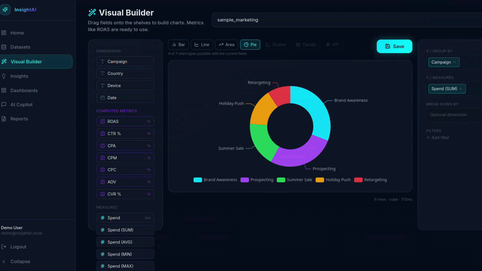

# InsightAI

AI-powered BI & analytics platform. Upload data, define metrics once in a
semantic layer, then explore visually, build dashboards, and ask an AI copilot
questions in plain English — with no dead data anywhere in the app.

Inspired by Metabase (visual builder + dashboards) and Cube.dev (semantic layer).

## Demo



## Architecture

```
Upload (CSV/XLSX/JSON/Parquet)
        │  Polars parse + schema inference
        ▼
Local DuckDB  ──────────────┐  (row-level preview, anomalies, copilot sql_tool)
        │                   │
        │  processed parquet │
        ▼                   │
     MinIO (S3)             │
        │  dbt-duckdb (or Polars fallback)
        ▼                   │
  marts parquet             │
        │                   │
        ▼                   │
   Cube Core  ◄─── dynamic data models fetched from FastAPI
  (semantic layer: ROAS, CTR, CPA … defined once)
        │                   │
        ▼                   ▼
  FastAPI  ──────────────────►  Semantic query service
   (only Cube client)          (Cube engine, DuckDB fallback)
        │
        ▼
  Next.js UI: Visual Builder · Insights · Dashboards · AI Copilot · Reports
```

**Why two engines?** The backend holds a persistent read-write DuckDB file;
DuckDB does not allow another process to open it concurrently. So Cube never
touches that file — ingestion writes Parquet to MinIO and Cube reads it over
S3 (`httpfs`). See `backend/app/modules/semantic/` and `cube/cube.js`.

**Dynamic Cube models.** Users upload arbitrary schemas, so Cube data models
can't be static files. `cube/cube.js` fetches them from the backend
(`/api/v1/internal/cube/models`) at compile time, keyed off a Redis schema
version that bumps whenever a dataset becomes ready or its semantic model
changes. 
Postgres stays the single source of truth.

## Stack

- **Backend**: FastAPI, SQLAlchemy 2 (async), Postgres, DuckDB, Polars,
  dbt-duckdb, Cube Core, MinIO, Redis, LangGraph + **Groq** (rotating model
  pool), APScheduler, ReportLab.
- **Frontend**: Next.js 15 (App Router, React 19), TypeScript, Tailwind,
  ECharts, TanStack Query, Zustand, **@dnd-kit** (builder shelves),
  **react-grid-layout** (dashboards).

## Quick start

```bash
cp .env.example .env      # then fill in the secrets below
make init                 # build, start, migrate, seed

```

Open http://localhost:3000 · API docs http://localhost:8000/api/docs ·
Cube http://localhost:4000 · MinIO console http://localhost:9001

Seeded logins: `admin@insightai.local / Admin@123456`,
`demo@insightai.local / Demo@123456`.

Generate a sample dataset to upload: `python scripts/gen_sample.py` →
`scripts/sample_marketing.csv`.

### Required secrets (`.env`)

| Variable | How to get it |
|----------|---------------|
| `GROQ_API_KEY` | https://console.groq.com/keys |
| `CUBEJS_API_SECRET` | `openssl rand -hex 32` |
| `CUBE_INTERNAL_TOKEN` | `openssl rand -hex 32` |
| `SECRET_KEY`, `JWT_SECRET_KEY` | any 32+ char random strings |

> ⚠️ **Rotate the committed keys.** The repository history contains a real
> OpenRouter key and a Groq key that were shared during development. Generate
> fresh secrets before deploying. `.env` is now git-ignored.

### The Groq model pool

`GROQ_MODELS` is an **ordered, comma-separated pool**. When a model hits its
rate limit it is put on a Redis cooldown (using the `retry-after` header) and
the next model takes over automatically — for both the agent and one-shot
completions. To track Groq's free-tier lineup, just edit this one env var; no
code change needed.

## Make targets

| Target | Description |
|--------|-------------|
| `make init` | First run: build + up + migrate + seed |
| `make up` / `make down` | Start / stop the stack |
| `make migrate` / `make seed` | Alembic upgrade / seed users |
| `make test-backend` | Run pytest in the backend container |
| `make verify` | Backend tests + frontend `tsc --noEmit` |

## Feature map

- **Visual Builder** (`/builder`) — drag dimensions/measures onto shelves,
  filter, switch chart types, save as an insight. Runs through the semantic
  layer, so ROAS and other computed metrics are first-class.
- **Insights** (`/insights`) — saved insights run live (not cached); pin,
  edit, delete, add to a dashboard, or create one from natural language.
- **Dashboards** (`/dashboards`) — react-grid-layout canvas; each widget
  fetches live data; drag/resize persists the layout.
- **AI Copilot** (`/copilot`) — Groq agent with a `semantic_query_tool`
  (aggregations) and a locked `sql_tool` (row-level). Any chart it produces can
  be saved as an insight or added to a dashboard.
- **Dataset detail** (`/datasets/[id]`) — tabs for Preview, Time Series,
  Anomalies, Compare, and a Semantic Model editor (column roles + computed
  metric builder).
- **Reports** (`/reports`) — background PDF generation from KPIs, discovery
  findings, and pinned insights; download links are regenerated on demand;
  schedules run via the in-process scheduler.

## Security notes

- All analytics SQL is built through `analytics/sql_builder.py`: identifiers
  are validated against the dataset's real columns and values are bound
  parameters. Free-form SQL is parsed with sqlglot and locked to the dataset's
  own table (`validate_select`).
- Cube queries carry a short-lived JWT with the tenant's allowed cubes;
  `cube.js`'s `queryRewrite` rejects cross-tenant access.
- The in-process APScheduler is only safe with a single backend worker
  (the compose file runs `--workers 1`).
